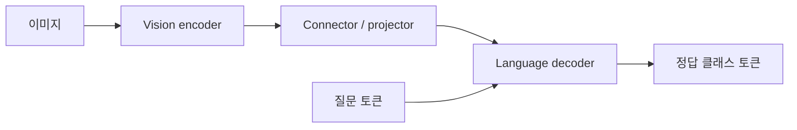

# Fine-tuning의 이론과 실습에서 연결되는 지점

처음 배우면 [고등학생 입문 수업](12_foundations.md)과 [단계별 계획](11_curriculum.md)부터 읽습니다. 이 문서는 대학 초반 이후의 수식 참고 자료이며, DPO/RLHF/RLVR의 심화 설명은 [post-training 수업](../04_post_training/README.md)에서 순서대로 다룹니다.

## 사전학습과 fine-tuning

LLM은 tokenizer가 만든 토큰 시퀀스에서 다음 토큰의 확률을 예측합니다. 문장이 `The sky is blue`이면 `The → sky`, `The sky → is`처럼 앞 토큰들로 다음 토큰을 예측합니다.

$$L(\theta)=-\frac{1}{N}\sum_{t\in T}\log p_\theta(x_t\mid x_{<t})$$

`T`는 loss를 계산할 위치입니다. CPT에서는 실제 문서 토큰, instruction SFT에서는 답변 토큰입니다. padding과 입력 질문은 필요에 따라 `labels=-100`으로 제외합니다. Transformers causal LM은 내부에서 logits/labels를 한 칸 옮깁니다. 데이터를 미리 한 칸 옮기면 double shift 오류가 됩니다.

Fine-tuning은 사전학습 가중치를 시작점으로 목적에 맞는 데이터로 추가 최적화합니다. 처음부터 언어 모델을 학습하는 것보다 계산량이 작지만, 적은 데이터에서 쉽게 과적합하고 원래 능력을 잃을 수 있습니다.

## Instruction SFT

instruction은 요청, context는 요청에 필요한 추가 자료, response는 원하는 출력입니다. 모델은 `p(response | instruction, context)`가 높아지도록 학습합니다. 이 저장소는 base 모델에도 사용할 수 있는 명시적 형식을 택합니다.

```text
### Instruction:
List three colors.

### Response:
red, blue, yellow<EOS>
```

질문 토큰은 조건으로 들어가지만 gradient의 정답 target에서는 제외합니다. 답변 끝 EOS는 학습해야 멈추는 패턴을 배웁니다. pad ID를 EOS로 설정해도 **실제 EOS와 padding을 위치로 구분**합니다. 모든 EOS ID를 일괄 마스킹하면 종료 학습이 사라집니다.

Instruct 모델을 표준 chat으로 사용하는 실제 서비스에서는 모델의 chat template가 중요합니다. 여기서는 세 도구 비교를 위해 같은 `instruction_response_v1` 형식을 사용하고 추론에도 유지합니다. 이미 Instruct인 모델이 원래 chat template에서 갖는 능력을 측정하는 추가 평가와 이 형식의 평가는 다른 실험입니다.

응답을 모두 잘라내면 유효 target이 없어 NaN이 나올 수 있습니다. 공통 encoder는 completion의 학습 공간을 확보하고 길이를 넘으면 prompt 앞부분을 줄입니다. 단, 필요한 문맥을 제거할 수 있으므로 실험에서는 잘린 예제 비율과 문맥 길이도 확인하고 충분한 `max_length`를 택합니다.

## 지식을 추가하는 CPT와 QA SFT

| 방식 | 학습 데이터 | loss 위치 | 잘하는 방향 | 별도로 확인할 것 |
|---|---|---|---|---|
| CPT | 원문 문서 | 문서 전체 | 도메인 문체·어휘·분포 적응 | 사실 QA, instruction 유지 |
| QA SFT | 질문/정답 | 정답 | 특정 질문 형식에서 답변 | 질문 변형, 새로운 사실, 과적합 |
| RAG | 검색 가능한 외부 문서 | 학습이 필수는 아님 | 현재 사실과 출처 활용 | 검색 품질, 문서 접근 권한 |

CPT는 사전학습과 같은 목표로 도메인 데이터를 계속 학습합니다. 문서 perplexity 감소는 해당 문서 분포를 예측하기 쉬워졌다는 뜻이며 사실 응답 정확도를 보장하지 않습니다. QA SFT는 출력 형식을 직접 가르치지만 답변쌍의 품질과 다양성에 크게 의존합니다. 도메인 계속학습의 연구 배경은 [Don't Stop Pretraining](https://aclanthology.org/2020.acl-main.740/)에서 확인할 수 있습니다.

자주 변하는 지식·검증 가능한 출처를 원할 때는 외부 검색을 결합하는 RAG도 비교합니다. Fine-tuning과 RAG는 병행 가능합니다. [RAG 원 논문](https://arxiv.org/abs/2005.11401)을 참고합니다.

## Full fine-tuning

모든 또는 선택한 원본 가중치에 gradient를 계산하고 optimizer로 업데이트합니다. 구현이 이해하기 쉽고 작은 모델의 기본 실습에 적합합니다. 학습 가능 파라미터가 많아 optimizer state와 gradient 메모리도 큽니다.

FP32 AdamW를 단순화하면 parameter 4B + gradient 4B + 1차/2차 moment 8B로 파라미터당 약 16 byte가 필요합니다. activation, 임시 buffer, 다른 dtype의 master weight, attention 메모리는 별도입니다. 따라서 이 식은 전체 VRAM 요구량이 아니라 **파라미터/optimizer 부분의 대략적 추정**입니다.

## LoRA

기존 선형층 `W`를 동결하고 작은 행렬 `A`, `B`를 학습합니다.

$$W'=W+\frac{\alpha}{r}BA,\quad A\in\mathbb{R}^{r\times d_{in}},\ B\in\mathbb{R}^{d_{out}\times r}$$

원래 `d_out × d_in`개를 학습하던 층에서 `r × (d_in+d_out)`개의 adapter 파라미터를 학습합니다. `r`은 rank, `alpha`는 스케일입니다. rank를 늘리면 표현 용량·학습 메모리가 늘지만 자동으로 품질이 좋아지지 않습니다. `target_modules`는 adapter를 넣을 위치이며 attention의 q/v 또는 더 많은 선형층을 선택할 수 있습니다.

LoRA를 저장하면 base 모델을 포함한 완전한 checkpoint가 아닙니다. 추론에서는 **같은 base 모델/revision + adapter + tokenizer**가 필요합니다. `merge_and_unload()`로 새 전체 모델을 만들 수 있습니다. [LoRA 원 논문](https://arxiv.org/abs/2106.09685), [PEFT 고정 버전 LoRA 안내](https://huggingface.co/docs/peft/v0.18.1/en/developer_guides/lora)를 참고합니다.

## QLoRA

동결한 base를 낮은 비트로 로드하고 LoRA adapter를 학습하는 접근입니다. 이 저장소의 HF QLoRA는 bitsandbytes NF4·double quantization과 적절한 floating-point compute dtype을 사용합니다. **4-bit 정수 가중치 전체를 직접 gradient update하는 실습이 아닙니다.**

Base 저장 메모리는 줄어들어도 activation·optimizer·adapter·임시 dequantization buffer가 필요합니다. 작은 모델에선 양자화 overhead가 커서 체감 이득이 작을 수 있습니다. 지원 CUDA 환경에서 먼저 LoRA/full로 흐름을 익힌 뒤 같은 조건의 QLoRA를 비교합니다. [QLoRA 원 논문](https://arxiv.org/abs/2305.14314), [HF bitsandbytes 문서](https://huggingface.co/docs/transformers/en/quantization/bitsandbytes)를 참고합니다.

## VLM의 학습



이미지는 patch/embedding으로 변환되고 텍스트 토큰과 함께 decoder의 조건이 됩니다. 모델 processor가 image token을 여러 patch 위치로 확장할 수 있으므로, 텍스트 tokenizer만으로 만든 길이를 label mask에 사용하면 위치가 어긋납니다. 이 실습의 mask는 processor가 만든 prompt/full 입력의 실제 token 위치를 기준으로 계산합니다. image token을 자르는 텍스트 truncation은 사용하지 않습니다.

언어 decoder만 학습하면 이미지 표현 자체는 유지되고 분류명으로 매핑하는 규칙이 바뀝니다. 시각적 도메인이 크게 달라 encoder/projector 적응이 필요하다면 학습 범위를 확장해 별도로 비교합니다. 모든 층을 푸는 것이 언제나 최선은 아닙니다.

## 학습률, accumulation, forgetting

큰 학습률·긴 학습·적은 다양성은 원래 능력을 손상시킬 수 있습니다. Loss 감소와 답변 품질 증가를 같은 것으로 취급하지 않습니다. validation으로 하이퍼파라미터를 선택하고 test는 최종 비교에 사용합니다.

Gradient accumulation은 여러 microbatch의 gradient를 모은 뒤 optimizer update를 합니다. epoch 끝에 남은 작은 window도 업데이트해야 하며 loss normalization을 맞춰야 합니다. PyTorch text 예제는 window의 유효 정답 토큰 수로 가중하여 마지막 불완전 window도 처리합니다. 다른 trainer의 loss 정규화 정의까지 확인해야 엄밀한 동등성 비교가 됩니다.
