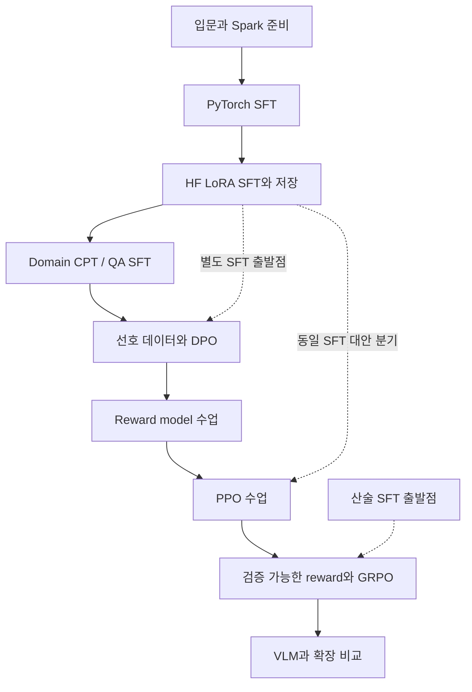

# 순서대로 배우는 fine-tuning / post-training 실습 계획

사용자 지시로 작업을 재개했습니다. 현재는 0단계의 환경 준비 검토와 짧은 동작 검사까지 진행하며, 모델 학습과 오래 걸리는 실행은 제외합니다. 아래 학습 절차는 이후 실습 계획입니다. 작성된 코드, 현재 데이터 가용성, 실제 수행 상태는 체크리스트와 검증 문서에서 구분합니다.

이 문서는 **무엇을 먼저 배우고, 어떤 결과를 확인한 후 다음 단계로 갈지** 정한다. [전체 체크리스트](10_practice_checklist.md)는 모든 도구/기법 조합의 진행표다. 처음부터 34개 조합을 한꺼번에 실행하지 않고 아래 주 경로를 한 단계씩 진행한다. 선택 비교는 주 경로를 이해한 뒤 수행한다.

## 교육 목표와 난이도

- 입문(고등학생): Python 함수/명령어/JSONL을 읽고, 토큰·정답 점수·모델 저장을 말로 설명한다. 미적분을 선수 지식으로 요구하지 않는다.
- 중간(대학 초반): 확률, 평균, 로그를 이용해 loss·batch·LoRA 메모리·데이터 누수를 계산한다.
- 심화(대학 수준): 조건부 확률, 미분/gradient, 기대값을 이용해 preference loss·KL·policy gradient·PPO clipping·GRPO advantage를 해석한다.
- 수식은 먼저 작은 예와 설명을 제공한 후 도입한다. 코드가 실행되어도 사람이 판단한 답변 품질이 향상되지 않을 수 있음을 모든 단계에서 확인한다.

[입문 수업](12_foundations.md)은 첫 단계의 선수 지식과 손계산, [이론](01_theory.md)은 중간 이후 참고 자료다. 기존 README의 수식부터 먼저 외울 필요는 없다.

## Post-training 구현 도구 선택

추가 과정은 **Hugging Face Transformers/PEFT + TRL** 한 경로로 작성한다. Domain은 Trainer/PEFT의 LoRA, DPO는 DPOTrainer+LoRA, RLHF는 RewardTrainer→PPOTrainer, RLVR는 GRPOTrainer+LoRA를 사용한다.

공개 실제 개발 사례에는 Llama 3의 SFT/DPO, InstructGPT의 reward model/PPO, DeepSeekMath의 GRPO가 있다. 관련 기법을 함께 제공하는 TRL을 재현 가능한 수업 경로로 선택했다. 세 도구의 전 세계 사용량을 비교한 통계가 없으므로 “점유율 1위”라고 단정하지 않는다. [Llama 3](https://arxiv.org/abs/2407.21783), [InstructGPT](https://arxiv.org/abs/2203.02155), [DeepSeekMath](https://arxiv.org/abs/2402.03300), [TRL 공식 저장소](https://github.com/huggingface/trl).

Domain fine-tuning은 별도의 RL 알고리즘이 아니다. 도메인 CPT와 task SFT를 묶은 데이터/목적의 선택이며, 기존 C4/S4/K3 케이스를 재사용한다. CPT는 계속 사전학습 목적, SFT/DPO/RL은 여기서 다루는 post-training 목적이라는 차이를 구분한다.

## 한 단계씩 진행하는 주 경로

| 단계 | 난이도 | 대표 실습 | 먼저 준비할 것 | 다음 단계로 가는 조건 |
|---|---|---|---|---|
| 0 | 고등학생 | Python·JSONL·토큰·Spark 첫 수업 | [입문 수업](12_foundations.md), [빠른 시작](00_quickstart.md) | JSONL 한 줄과 학습/평가 split의 차이를 설명 |
| 1 | 고등학생 | I1: PyTorch full instruction SFT | Dolly, SmolLM2 base, HF Spark 환경 | 학습→저장→재로딩 후 답변 3개 비교 |
| 2 | 고등학생→대학 초반 | I4: HF LoRA instruction SFT | 1단계 보고서, 같은 Dolly split | base+adapter와 full checkpoint 차이 설명 |
| 3 | 대학 초반 | C4/S4/K3: HF domain fine-tuning | SciQ support/QA, 일반 instruction baseline | CPT만/QA만/CPT→QA와 기존 능력 비교 |
| 4 | 대학 초반 | P1: DPO | SFT/merge checkpoint, chosen/rejected pairs | 선호 쌍 검증, 전후 preference·생성 평가 |
| 5 | 대학 초반→대학 | P2: reward model | 4단계 데이터/선호 개념 | held-out pair accuracy와 길이 편향 검사 |
| 6 | 대학 | P3: RLHF PPO | SFT policy와 학습한 reward checkpoint | rollout, KL, reward·길이·생성 품질 비교 |
| 7 | 대학 | P4: RLVR GRPO | 쉬운 산술 SFT, 독립 test, strict verifier | group reward 다양성과 held-out 정답률 비교 |
| 8 | 대학 | V1→V2: VLM domain adaptation | Beans images+labels, processor 이해 | image mask와 macro F1/오류 이미지 설명 |
| 9 | 대학 | 선택 비교/규모 확장 | 앞 단계의 재현 가능한 결과 | 조건을 맞춘 실험표와 실패 원인 기록 |

학습 순서는 설명 순서이며 모델을 무조건 직렬로 이어 붙이는 순서는 아니다. **DPO와 reward→PPO는 동일 SFT 출발점의 대안 분기**다. RLVR는 산술 SFT 출발점의 별도 분기다. Domain checkpoint를 preference 데이터와 이어 사용할 때는 도메인/형식 일치를 먼저 확인한다.

## 0–2단계: 정답을 보고 배우기

처음에는 “문장의 다음 조각을 맞히는 기계”로 생각한다. Base 모델에게 질문한다고 항상 답이 나오지 않는다. Instruction SFT는 질문을 주고 원하는 답을 여러 번 보여 준다. 예를 들어 “세 색을 써라”에는 “red, blue, yellow”가 정답이다. 모델이 정답에 높은 확률을 주면 loss가 작아진다.

1. [입문 수업](12_foundations.md)에서 토큰·loss·gradient를 작은 숫자로 확인한다.
2. [빠른 시작](00_quickstart.md)으로 Spark 컨테이너/overlay를 준비한다. 기존 데이터가 있으면 다운로드 명령은 생략한다.
3. [I1 PyTorch](../01_instruction/pytorch/README.md)의 full 학습을 실행한다. 기본 20 update는 코드 흐름 확인용이다.
4. 같은 prompt의 학습 전/후 생성 3개를 표로 적는다. “형식 준수/관련성/정확성”을 각각 판단한다.
5. [I4 HF LoRA](../01_instruction/huggingface/README.md)로 이동한다. 모델을 모두 바꾸는 대신 작은 추가 행렬만 바꿨다는 차이를 설명한다.
6. 저장 adapter를 별도 프로세스에서 다시 읽는다. 새 full checkpoint가 필요한 다음 실습에는 merge를 사용하고 base revision을 보존한다.

대학 초반으로 가는 질문: 응답 token만 loss를 계산하는 이유는 무엇인가? Padding을 정답으로 학습하면 무슨 문제가 생기는가? 같은 optimizer update 수가 같은 학습량을 보장하는가?

## 3단계: Domain fine-tuning

[Domain 실습](../04_post_training/domain_huggingface/README.md)에서 **과학 문서를 읽게 하기(CPT)**와 **과학 질문에 답하게 하기(QA SFT)**를 분리한다. 일반 instruction 능력을 가진 모델에서 시작한다.

실험은 같은 출발 모델의 세 갈래로 진행한다: CPT만, QA SFT만, CPT→QA SFT. CPT→QA가 항상 더 낫다는 가설을 강요하지 않는다. 과학 QA EM/F1, 문서 ppl, 일반 instruction 예시, 학습 시간/메모리를 함께 비교한다. 공개 SciQ가 “처음 보는 지식”이라고 주장하지 않는다.

원문 문단이 같거나 같은 문서에서 나온 질문이면 split을 document/group 기준으로 묶는 설계가 중요하다. 현재 작은 subset의 exact 중복 방지 외에 데이터 확장 시 semantic/source overlap을 추가 점검한다. 도메인 성능 증가와 일반 능력 감소가 동시에 나타나면 catastrophic forgetting을 설명한다.

## 4단계: DPO — 두 답 중 더 좋은 답 배우기

[DPO 실습](../04_post_training/dpo_huggingface/README.md)을 진행한다. “색 3개”라는 질문에 정확한 세 색 답은 chosen, 질문과 무관한 답은 rejected다. SFT가 하나의 모범 답을 따라 쓰는 수업이었다면 DPO는 두 답의 우선순위를 배우는 수업이다.

데이터 한 줄은 prompt/chosen/rejected이고 같은 prompt가 split을 넘지 않아야 한다. 자체 작성 fixture 선호는 사람 설문 결과가 아니다. 작은 DPO loss 감소를 “인간 가치 정렬 완료”라고 쓰지 않는다.

뒤의 수식 수업에서는 policy와 고정 reference의 응답 log probability 차이를 배운다. Reference를 현재 SFT 출발점으로 정하고 beta와 reward margin의 의미를 설명한다. Pair metric과 실제 생성 평가는 다르며 둘 다 기록한다.

## 5–6단계: Reward model → RLHF PPO

[RLHF 실습](../04_post_training/rlhf_ppo_huggingface/README.md)을 따른다. Reward model은 답변을 채점하는 별도 모델이다. 선호 쌍으로 채점기를 먼저 학습하고 held-out 쌍을 더 잘 정렬하는지 확인한다. 그다음 policy가 답변을 생성하고 채점기의 점수를 바탕으로 PPO update를 진행한다.

Policy(답하는 모델), reference(원래 행동 기준), reward model(채점기), value model(예상 보상)의 역할을 먼저 말로 설명한다. 대학 수준에서는 Bradley–Terry pair loss, advantage, KL penalty, PPO ratio clipping, value loss를 연결한다.

DPO 결과를 PPO 출발점으로 자동 연결하지 않는다. 같은 SFT 모델에서 시작해 DPO와 PPO를 비교한다. PPO가 reward를 올리면서도 답변이 길어지거나 반복이 늘면 reward hacking/length bias를 조사한다. Learned reward만으로 최종 품질을 판정하지 않고 독립 test와 사람이 읽은 예시를 함께 보존한다.

## 7단계: RLVR GRPO — 답을 직접 검산하기

[RLVR 실습](../04_post_training/rlvr_grpo_huggingface/README.md)에서 작은 정수 산술을 사용한다. 사람 선호를 예측하는 채점기 대신 verifier가 답이 맞는지 계산한다. RLVR는 **보상의 출처**, GRPO는 **policy 최적화 방법**이다. 같은 의미의 용어가 아니다.

한 질문에서 여러 답을 생성하고 같은 그룹의 reward를 비교해 advantage를 얻는다. 모든 답이 틀리거나 모두 맞으면 그룹 내 상대 신호가 사라질 수 있다. 먼저 쉬운 산술 SFT와 채점기 단위 사례를 준비하고 실패를 “step만 더 늘리면 해결”이라고 설명하지 않는다.

정답 숫자를 여러 개 쓰면 하나쯤 맞을 수 있으므로 verifier는 단일 최종 정수 형식을 엄격하게 확인한다. 정답률뿐 아니라 invalid-format rate, reward 분산/zero-variance 그룹, 길이, KL, 독립 test 결과를 본다. 단순 산술 fixture에서 성공해도 일반 추론 능력 향상이라고 확장하지 않는다.

## 8–9단계: VLM과 선택 실험

[V1 PyTorch](../03_vision/pytorch/README.md)에서 이미지와 텍스트 토큰이 만나는 위치를 보고, [V2 HF](../03_vision/huggingface/README.md)에서 언어 LoRA로 이미지 분류명을 학습한다. [V3 Unsloth](../03_vision/unsloth/README.md)는 별도 3B 모델 경로다. 다른 모델의 시간 차이를 도구 속도 차이로 단정하지 않는다.

이제 I2/I3/I5/I6/I7과 나머지 지식 기법 비교를 진행한다. 모델 revision, 데이터, token budget, seed와 학습 파라미터 범위를 고정한다. 반복 seed나 데이터 수 확대는 [추가 실험](08_next_experiments.md)을 따른다. 작은 실행부터 모델 크기를 늘린다.

## 매 단계 공통 기록

- [ ] 선수 수업의 완료 기준을 충족했다.
- [ ] 데이터 예시 3개와 split/manifest를 읽었다.
- [ ] 같은 조건의 baseline을 저장했다.
- [ ] 새 출력 경로로 학습하고 명령·revision·seed·metadata를 남겼다.
- [ ] 저장 결과를 별도 프로세스로 재로딩했다.
- [ ] 전후 지표와 오류 예시를 비교하고 개선/악화 원인을 적었다.
- [ ] 체크리스트와 TASK_LOGS에 실제 시각·case ID·보고서 경로를 갱신했다.

현재 CUDA 수행은 미확인이다. 이 계획의 체크박스는 학습 결과를 자동 판정하지 않으며 실제 근거를 보고 갱신한다.
